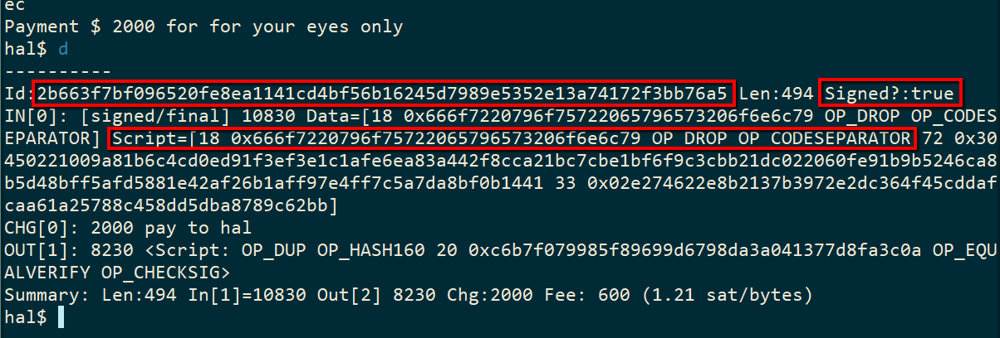
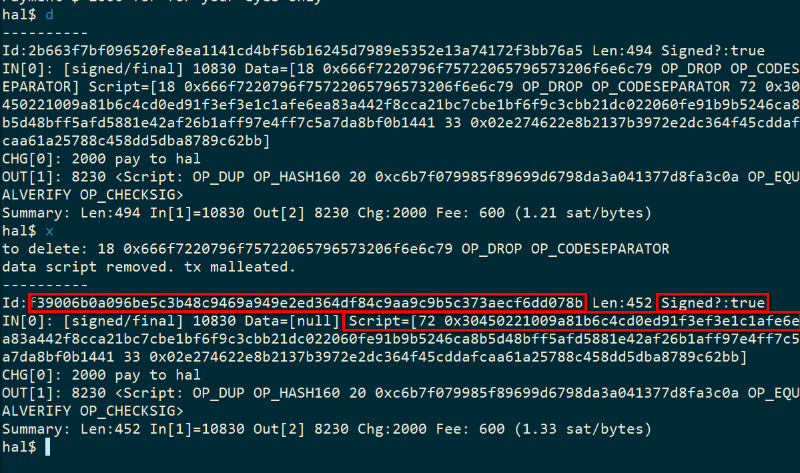
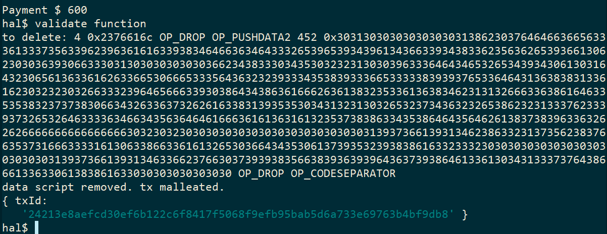
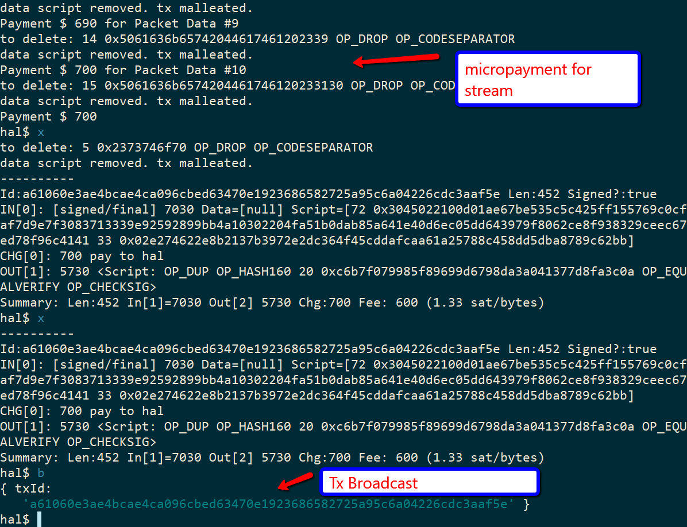

# ubiquity-hackathon

For more background information on the project please refer to the [docs/README.md file](docs/README.md).  

Pending documents to be uploaded to /docs
- Project description
- Ideas for UI

Technical highlights
- Extend the reach of the bitcoin protocol into the p2p model
- Use direct P2P channels built upon the [dat project](https://datproject.org/)
- P2P data exchange over payment channels
- Execute script before broadcasting a transaction
- Malleate Tx by executing scriptSig
- Push serialized transactions onto stack by embedding them into other transactions

Bitcoin Ubiquity means...
 - There is value in the protocol. Use the Bitcoin protocol.
 - The Bitcoin protocol is data within script within a transaction.
 - When a peer gives you script then execute the script.
 - P2P extends the reach of the bitcoin protocol.
 - Exchange all data within the protocol.

# Install and Run
This project requires a modified bsv library. See https://github.com/dfoderick/bsv/tree/p2p. This branch will be installed using `npm install`. See package.json file for details.  

```
git clone https://github.com/dfoderick/ubiquity-hackathon
cd ubiquity-hackathon
npm install
node src/index
```
Note: If you have a 'git' error when installing then you might need to upgrade npm.

Once installed, app can be run with `node src/index`. Run from root of project so that the wallet knows how to find the existing wallets (satoshi and hal). The output is shown below.

> Note: Run two instances to simulate 2 peers on network.

See Known Issues at bottom of this document for help.

```
$node src/index
You are Dave (d65efeab2a8e2557d1e61ec2c8ac27f6d2f4575d043a58f8afa835e64eaadf7f)
Listening to port: 3791
Subscribed to channel metanet
ubiquity$ help

  Commands:

    help [command...]   Provides help for a given command.
    exit                Exits application.
    peers               show peers
    iam <handle>        changes your handle and wallet
    @ <peer>            connect direct p2p exchange with peer seq
    send xpub           send your wallet xpub
    pay <amount> <fee>  sends payment tx to peer. peer will broadcast
    w                   show wallet utxos
    debug               debug. show payment transaction
    execute             Execute script on the payment transaction.
    broadcast           broadcast the transaction
    fact <n>            requests peer to calculate factorial
    sign                finalize and sign the transaction
    stream              starts a data stream pull with peer
    stop                stop the data stream
    validatetx          Validates Tx in mempool or a block
```

# Basic Commands
peers = will show current peers in your channel  
iam = announces your handle and switches to the wallet with that name (i.e. wallet_satoshi.json)  
`@ <handle>` = connect to peer with that handle (use a space after @)  
`w` = show wallet utxos  
`d` = debug. shows the current payment transaction    
`x` = execute. execute the scriptSig if there are pushdata opcodes  
`s` = sign. sign the current payment tx  
`b` = broadcast the current payment tx. if fails look at error meesage. There is help in /docs

Other commands that will be used in examples.  
`pay <amount> <fee>` = sends payment tx to peer for that amount. You can consolidate utxo by paying peer. peer should `x` and `b` to broadcast.  
`val` = pays peer to validate tx. use 'd' to show results.  
`stream` = start streaming. displays meter of running costs.  
`stop` = stops the stream. peer that started the stream will need to execute, sign and broadcast.  

# General setup for each example
After running `node src/index` you initialize a direct p2p connection using the `iam` and `@` commands as shown below.

|Peer1 (Satoshi)|Peer2 (Hal)|
|----|----|
|iam satoshi|iam hal|
|@ hal||
|w||

Peers will exchange public keys.

Make sure Satoshi has balance in wallet. If needed, fund the address with moneybutton. If needed, consolidate utxos using the `pay` command.

The following examples might be safe to run in order, without resetting the app. The app only keeps track of one payment transaction (shown with the `d` command)

# Example 1: Simple cash gifting with private messaging
This example is a bit facetious but it provides an good introduction on how to use the app and shows off what p2p is doing under the hood.  Note the use of scriptSig malleation.

How does this relate to onboarding? Satoshi was the original Bitcoin onboarder who sent 10 Bitcoin to Hal Finney. Gifting small payments is one way to onboard.

|Peer1 (Satoshi)|Peer2 (Hal)|
|----|----|
|`pay 2000 500 -f 'for your eyes only'`|`d` (debug). Notice that there is push data in scriptSig. Transaction is validly signed. 
|
||`x` (execute script to malleate tx). Notice that any push data with a corresponding DROP has been removed. Tx is still validly signed. 
|
||`b` (broadcast)|
||`w` (wallet balance has increased)|


# Example 2: Earn BSV income as a Provider
In the early days of mining a user could leave their computer hashing at night and wake up the next morning with some Bitcoin to spend. It was a simple method of onboarding new users using proof of work. We resurrect that idea below. 
Providers get paid by performing specialized calculations. Under this proposal, they would leave their computer on and when someone uses it for a calculation then they get paid. It is not presented here but there would probably be a P2P marketplace between the user and the provider that would perform peer discovery (match peers).

Note the use of pushing a serialized transaction onto the stack in this example.

Numerous means exist for providers to capture streams of revenue. Some ideas include ...
 - Transaction validation
 - Gaming server
 - Smart contract autonomous agent
 - Other specialty scientific computing

|Peer1 (Satoshi)|Peer2 (Hal)|
|----|----|
|val|Hal will get the serialized tx from the stack, validate the tx, broadcast the payment and send the result (true/false) to Satoshi|
|d (to see result)|w (to see payment in wallet)|



# Example 3: Stream micro-payments for usage metering
This example uses a micro payment channel for metering data usage. It does not actually show a video stream but the idea is that the data stream would include packets of video or some other data - the user has to use their imagination on this one. The important thing is to see how Hal's balance goes up while Satoshis decreases. It could be used for people who agree to watch a video in exchange for BSV (advertising, for example). Earn money while browing the internet, clicking on adds, filling out product surveys, live streaming of events. Anything with metered usage.

|Peer1 (Satoshi)|Peer2 (Hal)|
|----|----|
|stream|display will show data stream and payment metering|
|stop| x (execute script)|
|| b (broadcast)|



* Bug Fixed. Hal is supposed to be able to broadcast the last tx since the `stop` command was signed by Satoshi. If Hal cannot broadcast then Satoshi can execute, sign and broadcast as a work around.

# Known Issues
1) Dust can build up rapidly. You have to clean up dust. Options: Rename wallet.json to wallet_backup. `iam` command will create a new wallet. Use pay command to send dust to peer. Use `<amount>` and `<fee>` to control the size of the transaction. If tx too big then broadcast locally.
2) dat project has a limit on the size of a message. If you get json serialization errors you can try again. If it keeps happening then you need to reduce the size of the transaction.
3) dat can sometimes lose the connection. Restart the app.
4) Look carefully at broadcast errors. Often it is because you need to run `x` before `b`.

# Error codes
The following lists some common error message and how to fix or get around them. Most of these are tx broadcast errors.   

vin-empty  
    means there is no input to tx. usually will happen when a message envelope tx 
    is getting broadcast instead of the embedded serialized tx

16: mandatory-script-verify-flag-failed (Signature must be zero for failed CHECK(MULTI)SIG operation). Code:-26 
    Seems like this error happens when signing too many times    
    Still debugging but seems like error went away when removed signing of tx when sendpeer

Dust amount detected in one output  
    Means one of the outputs is 0 

Change address is missing  
 
undefined - For more information please see: https://bsv.io/api/lib/transaction#serialization-checks  
    Means something is seriously wrong with tx. Negative outputs or fees.  

Provided public keys don't hash to the provided output  
    For multisig means both pub keys are not available

Invalid state: Not all utxo information is available to sign the transaction  

message 64: scriptsig-not-pushonly. Code:-26  
    findAndDelete needs to be run on the inputs

Transaction has no inputs to add Command!  
    means pushdata could be added to tx because it doesnt have any inputs yet
