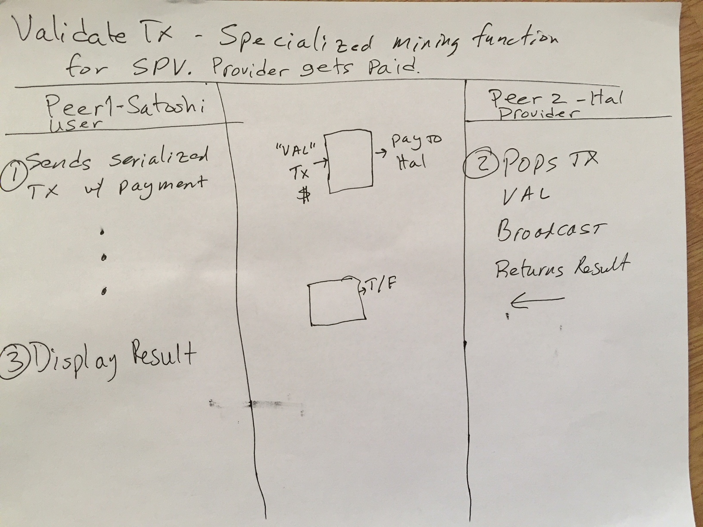

# Project documents
Example 1: Simple Gift using p2p

Example 2: Provider using p2p

Example 3: Stream micropayment using p2p

# Video
The following videos provide some background into the concepts used in this hack.

Mining specialization.   
https://www.youtube.com/watch?v=8_SoIXUBIhw&feature=youtu.be

scriptSig malleation. Payment channels.  
https://www.finder.com.au/craig-wright-on-spv-im-sick-of-people-not-getting-it

# Error codes
The following lists some common error message and how to fix or get around them. Most of these are tx broadcast errors.   

vin-empty  
    means there is no input to tx. usually will happen when a message envelope tx 
    is getting broadcast instead of the embedded serialized tx

16: mandatory-script-verify-flag-failed (Signature must be zero for failed CHECK(MULTI)SIG operation). Code:-26 
    Seems like this error happens when signing too many times    
    Still debugging but seems like error went away when removed signing of tx when sendpeer

Dust amount detected in one output  
    Means one of the outputs is 0 

Change address is missing  
 
undefined - For more information please see: https://bsv.io/api/lib/transaction#serialization-checks  
    Means something is seriously wrong with tx. Negative outputs or fees.  

Provided public keys don't hash to the provided output  
    For multisig means both pub keys are not available

Invalid state: Not all utxo information is available to sign the transaction  

message 64: scriptsig-not-pushonly. Code:-26  
    findAndDelete needs to be run on the inputs

Transaction has no inputs to add Command!  
    means pushdata could be added to tx because it doesnt have any inputs yet
